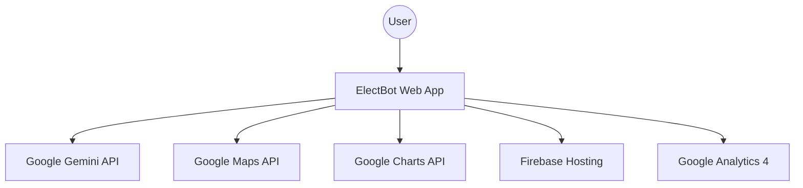

# 🗳️ ElectBot — AI Election Process Assistant

> **Vertical:** Civic Education / Election Assistant
> **Approach:** Gemini-powered conversational AI + Google APIs ecosystem

ElectBot is an interactive web application designed to simplify the complexities of the election process. Built with a suite of Google technologies, it provides users with AI-powered guidance, interactive timelines, and real-time mapping tools to encourage informed civic participation.

---

## 🌟 Key Features

### 🤖 1. AI Election Assistant (Gemini)
A sophisticated conversational interface powered by **Google Gemini**. It provides instant, factual answers to voter questions about registration, eligibility, and procedures.
- **Location:** `public/chat.html`
- **Logic:** `public/js/gemini.js`

### 📍 2. Interactive Polling Finder (Google Maps)
Visualizes nearby polling stations with markers and info windows. Includes category filters for accessibility and early voting.
- **Location:** `public/map.html`
- **Integration:** Dynamic loading of Google Maps JS SDK via centralized config.

### 📅 3. Dynamic Election Timeline
A step-by-step visual roadmap of the election cycle, from announcement to results, featuring countdowns and detailed phase descriptions.
- **Location:** `public/timeline.html`

### 🧠 4. Civic Knowledge Quiz
A gamified experience to test and improve voter awareness, featuring instant feedback and educational explanations.
- **Location:** `public/quiz.html`
- **Logic:** `public/js/quiz.js`

### 📊 5. Data Visualizations (Google Charts)
Interactive charts and data feeds providing insights into voter turnout and historical election statistics.
- **Location:** `public/news.html`

---

## 🏗️ Technical Architecture



---

## 🚀 Getting Started

### 1. Configuration (Crucial)
The project uses a centralized configuration file to manage API keys securely.

1.  Open `public/js/config.js`.
2.  Add your API keys to the `CONFIG` object:
    ```javascript
    const CONFIG = {
      GEMINI_API_KEY: 'YOUR_KEY_HERE',
      GOOGLE_MAPS_API_KEY: 'YOUR_KEY_HERE',
      GA4_MEASUREMENT_ID: 'G-XXXXXX',
      // ... Firebase config
    };
    ```

### 2. Local Execution
You can run the project using any static file server:
```bash
# Using npm
npm install
npm start
```
Then visit `http://localhost:3000`.

### 3. Deployment to Render
Render is a great way to host this project for free.

1.  **Connect GitHub**: Create a new **Static Site** on Render and connect this repository.
2.  **Build Settings**:
    - **Build Command**: `npm run build`
    - **Publish Directory**: `public`
3.  **Environment Variables**:
    Add the following in the Render dashboard:
    - `GEMINI_API_KEY`: Your Google Gemini key.
    - `GOOGLE_MAPS_API_KEY`: Your Google Maps key.
    - `GA4_MEASUREMENT_ID`: Your GA4 ID.
4.  **Deploy**: Render will build the site, inject your keys into the config, and host it!

### 4. Deployment to Firebase
The project is also ready for **Firebase Hosting**:
```bash
firebase deploy
```

---

## 📁 File Structure

```text
/
├── public/
│   ├── index.html        # Landing Page
│   ├── chat.html         # AI Chat Interface
│   ├── map.html          # Google Maps Integration
│   ├── timeline.html     # Election Timeline
│   ├── js/
│   │   ├── config.js     # Centralized API Keys
│   │   ├── gemini.js     # AI Logic
│   │   └── animations.js # UI/UX Effects
│   └── css/              # Design System
├── .gitignore            # Protects config.js & secrets
├── firebase.json         # Hosting Config
└── README.md
```

---

## 🔒 Security Note
A `.gitignore` has been included to prevent `public/js/config.js` from being pushed to public repositories. **Always restrict your API keys** to your specific domain in the Google Cloud Console for production use.

---

## 🛠️ Powered By
- **Google Gemini API**
- **Google Maps Platform**
- **Google Charts**
- **Firebase Hosting**
- **Google Analytics 4**

Built for **Google Prompt War** challenge. 🚀